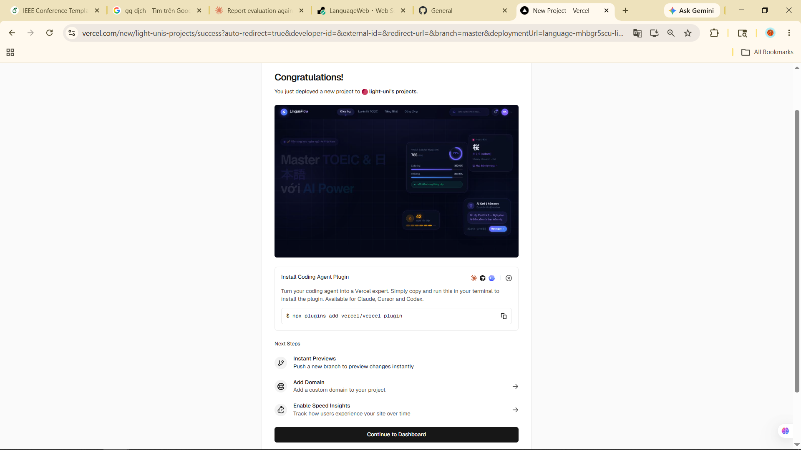

# LinguaBot AI — Training Pipeline

This directory contains everything you need to train your own **custom AI model** for LinguaFlow — no external APIs required.

---

## 🗺️ Overview

```
ai_training/
├── dataset/
│   └── sample_toeic_japanese.jsonl   ← Training data (add your own examples here)
├── finetune.py                        ← LoRA fine-tuning script
├── export_gguf.py                     ← Merge + export to Ollama-compatible GGUF
└── README.md                          ← This file
```

---

## ⚡ Quick Start — Use Ollama Without Fine-Tuning (Recommended First)

For most use cases, a good base model with LinguaBot's system prompt is **excellent** without any training.

### Step 1: Install Ollama

Download from **https://ollama.com/download** and install it.

### Step 2: Pull a Model

Choose based on your hardware:

| Your Hardware | Recommended Model | Command |
|---|---|---|
| GPU ≥ 8GB VRAM | Qwen 2.5 7B | `ollama pull qwen2.5:7b` |
| GPU 4–8GB | Qwen 2.5 7B Q4 | `ollama pull qwen2.5:7b-q4_K_M` |
| CPU only | Qwen 2.5 1.5B | `ollama pull qwen2.5:1.5b` |

### Step 3: Configure LinguaFlow

In `backend/.env`:

```env
AI_PROVIDER=local
OLLAMA_HOST=http://localhost:11434
LOCAL_AI_MODEL=qwen2.5:7b
```

### Step 4: Start the Backend

```bash
cd backend
python manage.py runserver
```

That's it! The LinguaBot chat in the browser will now use your local model. ✅

---

## 🎓 Advanced — Fine-Tune Your Own Model

Fine-tuning trains the model specifically on TOEIC/Japanese data, making it even more domain-expert.

### Hardware Requirements

| Training Mode | Min VRAM | Recommended |
|---|---|---|
| 7B model (4-bit QLoRA) | 12 GB | 16–24 GB |
| 3B model (full LoRA) | 8 GB | 12 GB |
| 1.5B model (full LoRA) | 6 GB | 8 GB |

> **No GPU?** Use [Google Colab](https://colab.research.google.com) (free T4 GPU) or [Kaggle Notebooks](https://kaggle.com/notebooks) (free P100 GPU).

---

### Step 1: Set Up Training Environment

```bash
# Create a separate venv for training (heavy dependencies)
python -m venv training_venv
training_venv\Scripts\activate   # Windows
# source training_venv/bin/activate  # Linux/Mac

# Install training dependencies
pip install torch torchvision --index-url https://download.pytorch.org/whl/cu121
pip install transformers peft trl datasets accelerate bitsandbytes
```

---

### Step 2: Prepare Your Dataset

The dataset is in **JSONL format** — one training example per line. Each line is a JSON object with a `messages` key containing a conversation:

```json
{"messages": [
  {"role": "system", "content": "You are LinguaBot..."},
  {"role": "user", "content": "Explain 'rise' vs 'raise' in TOEIC."},
  {"role": "assistant", "content": "### Rise vs Raise..."}
]}
```

Add your own examples to `dataset/sample_toeic_japanese.jsonl`.

**Tips for a good dataset:**
- Aim for **200–500 examples** minimum; 1,000+ for best results
- Cover all three domains: TOEIC, Japanese, Programming
- Use natural Vietnamese + some English questions (mirrors real user input)
- Make responses structured with Markdown headings and examples

---

### Step 3: Run Fine-Tuning

```bash
cd backend/ai_training

python finetune.py \
  --base_model Qwen/Qwen2.5-7B-Instruct \
  --dataset_path dataset/sample_toeic_japanese.jsonl \
  --output_dir ./lora_adapters \
  --num_train_epochs 3 \
  --lora_r 16 \
  --load_in_4bit
```

Training takes **30 minutes – 3 hours** depending on dataset size and hardware.
The LoRA adapter is saved to `./lora_adapters/`.

---

### Step 4: Export to Ollama (GGUF)

#### 4a. Install llama.cpp

```bash
git clone https://github.com/ggerganov/llama.cpp
cd llama.cpp
cmake -B build && cmake --build build --config Release -j4
```

#### 4b. Run the Export Script

```bash
cd backend/ai_training

python export_gguf.py \
  --base_model Qwen/Qwen2.5-7B-Instruct \
  --lora_dir ./lora_adapters \
  --output_dir ./merged_model \
  --gguf_output ./linguabot.gguf \
  --llama_cpp_dir /path/to/llama.cpp \
  --quantisation Q4_K_M
```

This will:
1. Merge the LoRA weights into the base model
2. Convert to quantised GGUF format
3. Generate an Ollama `Modelfile` with the LinguaBot system prompt

#### 4c. Register with Ollama

```bash
ollama create linguabot -f ./Modelfile
ollama run linguabot   # Test it interactively
```

#### 4d. Update `.env`

```env
AI_PROVIDER=local
LOCAL_AI_MODEL=linguabot
```

Restart the Django server — your custom fine-tuned LinguaBot is now live! 🎉

---

## 🧪 Testing the AI

### Quick API Test (Command Line)

```bash
curl -X POST http://localhost:8000/api/ai/chat/ \
  -H "Authorization: Bearer <your_jwt_token>" \
  -H "Content-Type: application/json" \
  -d '{
    "messages": [{"role": "user", "content": "Giải thích trợ từ は và が"}],
    "language": "vi",
    "context": "japanese"
  }'
```

### Check Ollama Status

```bash
curl http://localhost:8000/api/ai/status/ \
  -H "Authorization: Bearer <your_jwt_token>"
```

Expected response:
```json
{
  "active_provider": "local",
  "local_ai": {
    "status": "online",
    "host": "http://localhost:11434",
    "configured_model": "qwen2.5:7b",
    "model_ready": true,
    "available_models": ["qwen2.5:7b"]
  }
}
```

---

## 📊 Model Comparison

| Approach | Setup Time | Quality | Cost | Privacy |
|---|---|---|---|---|
| Gemini/GPT API | 5 min | ⭐⭐⭐⭐⭐ | 💰 Per request | ❌ Data sent externally |
| Ollama (base model) | 15 min | ⭐⭐⭐⭐ | Free | ✅ 100% local |
| Ollama (fine-tuned) | 2–4 hours | ⭐⭐⭐⭐⭐ | Free | ✅ 100% local |
